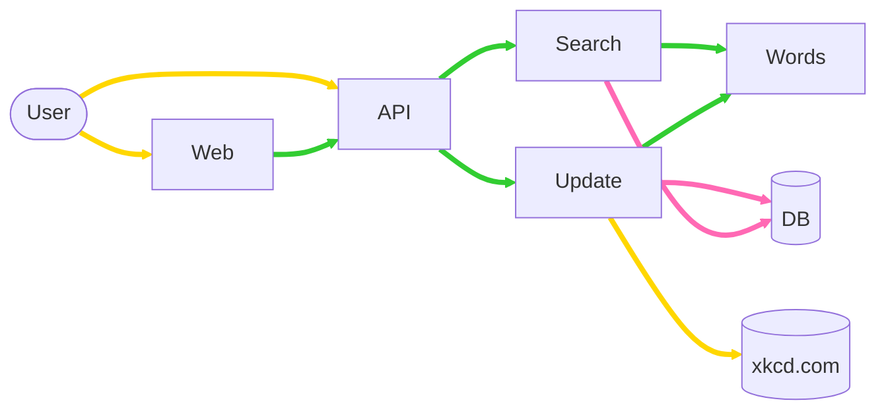
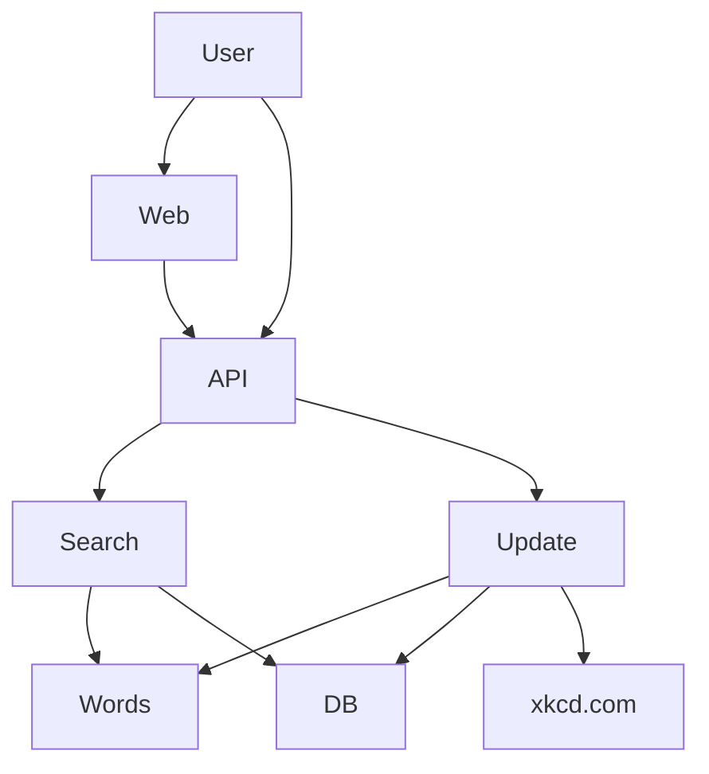

# Разработка микросервисных приложений на Golang

## Описание
Язык программирования Go (Golang) применяется для создания высокопроизводительных и надежных систем. Его используют для написания облачных сервисов, серверных приложений, для автоматизации процессов в больших масштабах, в работе с ИИ и большими данными.
Go используют DevOps-инженеры, backend-разработчики, специалисты по функциональной верификации цифровых устройств.

На курсе участники создадут микросервисное приложение. Научатся создавать и тестировать конкурентные приложения на Go, работать с популярными библиотеками и внешним API, развертывать свои решения в контейнерах.

[Подробнее](https://careers.yadro.com/practical-courses/golang/)

---
Данный репозиторий является ознакомительным и содержит задания, выполненные мной в течение курса. 

TODO добавить навигацию и краткое описание каждого из заданий

# Демонстрация финальной работы
## Поисковик для комиксов для сайта xkcd

### Что было сделано?
* Добавлен frontend
  * Выполнен полностью на Go template с минимальным использованием javascript
  * Стили с использованием scss
* Заменен Postgres на Couchbase
  * Обновлен микросервис Update и Search

## Видео
[Демонстрация работы](https://youtu.be/q6A6eaBLETs)
